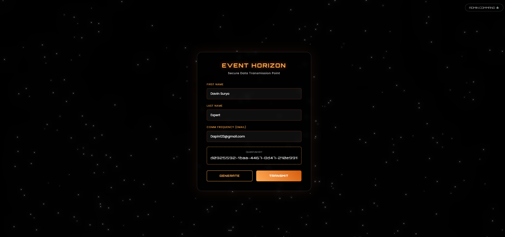
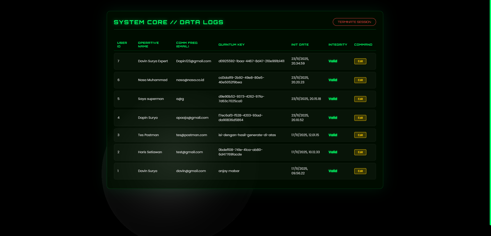
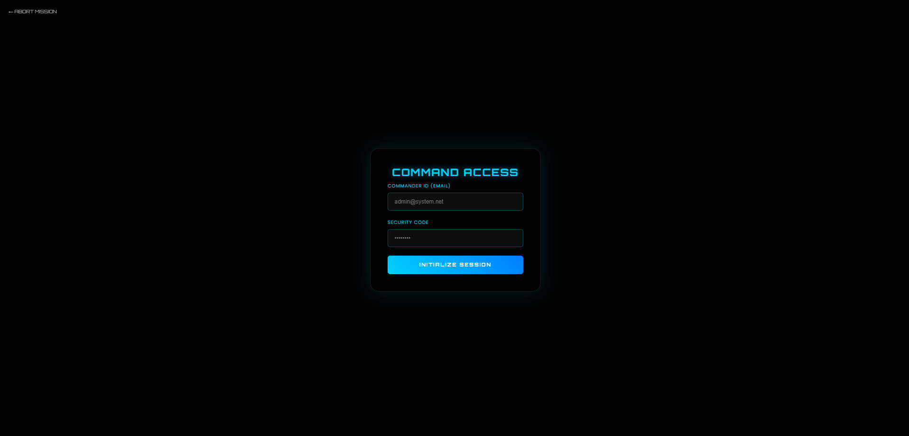
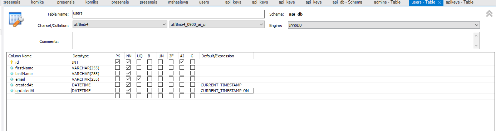

# 🪐 Galactic API Manager


**Galactic API Manager** adalah sistem manajemen API Key berbasis Node.js yang dikemas dengan antarmuka futuristik bertema luar angkasa (*Sci-Fi Event Horizon*). Proyek ini menggabungkan keamanan backend yang ketat dengan visualisasi frontend 3D yang memukau.

---

## 📸 Screenshots

| **User Interface (Event Horizon)** | **Admin Dashboard (Mars Core)** |
|:---:|:---:|
|  |  |
| *Three.js Black Hole Simulation with Glassmorphism Form* | *3D Mars Visualization with Holographic Data Grid* |

| **Login Admin** | **MySQL** |
|:---:|:---:|
|  |  |
| *Three.js Black Hole Simulation with Glassmorphism* | *Using mySQL* |

[Screenshoot](./screenshots/)

---

## ✨ Fitur Utama

### 🛡️ Backend (Security & Logic)
* **Authentication:** Login Admin aman menggunakan **JWT (JSON Web Token)**.
* **API Key Management:** Generate, validasi, dan manajemen masa aktif API Key (valid 30 hari).
* **Database Relational:** Struktur database ternormalisasi menggunakan **MySQL** & **Sequelize ORM**.
* **Security:** Password hashing dengan **Bcrypt** dan proteksi Environment Variables.

### 🎨 Frontend (Visual & UX)
* **Immersive 3D Backgrounds:**
    * *User Page:* Simulasi Lubang Hitam (Gargantua) dengan partikel akresi.
    * *Dashboard:* Render Planet Mars 3D realistis dengan pencahayaan dinamis.
* **Glassmorphism Design:** UI transparan modern dengan efek blur dan neon glow.
* **Responsive:** Tampilan simetris dan responsif di berbagai perangkat.

---

## 🚀 Cara Menjalankan (Installation)

Ikuti langkah ini untuk menjalankan proyek di komputer lokal Anda:

1.  **Clone Repositori**
    ```bash
    git clone [https://github.com/username-anda/galactic-api.git](https://github.com/username-anda/galactic-api.git)
    cd galactic-api
    ```

2.  **Install Dependencies**
    ```bash
    npm install
    ```

3.  **Konfigurasi Database**
    * Buat database MySQL baru bernama `api_db`.
    * Duplikasi file `.env.example` menjadi `.env` dan sesuaikan konfigurasi:
    ```ini
    DB_HOST=localhost
    DB_USER=root
    DB_PASS=password_anda
    DB_NAME=api_db
    JWT_SECRET=rahasia_super
    ```

4.  **Jalankan Server**
    ```bash
    node server.js
    ```

5.  **Akses Aplikasi**
    * User Page: `http://localhost:5000`
    * Admin Login: `http://localhost:5000/login.html`

---

## 🛠️ Tech Stack

* **Runtime:** Node.js
* **Framework:** Express.js
* **Database:** MySQL
* **ORM:** Sequelize
* **Frontend:** HTML5, CSS3 (Animations), Vanilla JS
* **3D Library:** Three.js (WebGL)

---

## 👨‍💻 Author

**Davin**
* GitHub: [@Davinsry](https://github.com/Davinsry)

---
*Built with 🪐 and ☕ code.*
